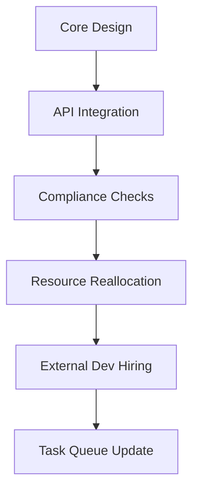

A dynamic project timeline with iterative revisions:
- **Phase 1 (Initial Draft):** Core objectives defined: "Build a modular system for X" and "Integrate Y APIs."
- **Feedback Loop (Week 1):** Stakeholder input reveals:
  - *Requirement Change:* "Replace Y with Z due to compliance issues."
  - *Resource Adjustment:* "Team size reduced by 20%; delay Q2 milestone by 1 week."
- **Phase 2 (Rework):** Revised plan:
  - **Tasks:**
    - Task A (✓): "Design API bridge for Z" (2 weeks).
    - Task B (⏳): "Document compliance changes" (1 week, deferred).
    - Task C (⏳): "Recruit additional devs" (1 week, outsourced).
  - **Dependencies:** Task C triggers Task B.
- **Milestone Adjustments:**
  - Original Q2 target: "Feature freeze" → New: "Alpha v1 release (Q2-End)."
- **Tools:** Jira updated with:
  - **Story:** "Compliance-ready API wrapper for Z"
  - **Board:** Task C (Outsourced) → Task A (In Progress).
- **Risks Tracked:**
  - *Z API stability:* "Unspecified ETA for docs."
  - *Team attrition:* "1 dev on leave; monitor Task B progress."

---
**Visualization (Pseudocode):**
